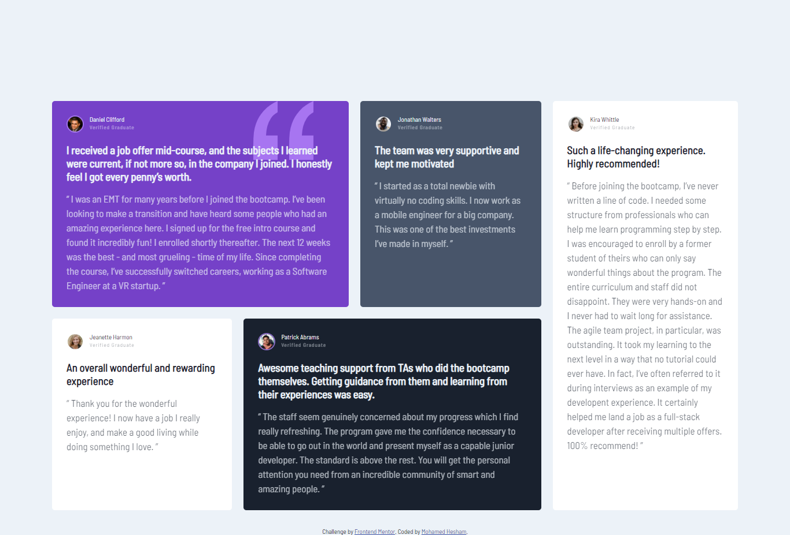

# Frontend Mentor - Testimonials grid section solution

## Overview

### The challenge

Users should be able to:

- View the optimal layout for the site depending on their device's screen size

### Screenshot




### Links

- Solution URL: [Add solution URL here](https://your-solution-url.com)
- Live Site URL: [Add live site URL here](https://your-live-site-url.com)

### Built with

- Semantic HTML5 markup
- CSS custom properties
- CSS Grid
- Mobile-first workflow

### What I learned
css grid area is the best way to do beautiful layouts with perfect customization and it is give me little lines of code to do this challenge.

```css
.grid-template-areas: ""
```

## Author

- Website - [Mohamed Hesham]
- Frontend Mentor - [@mohamedhesham221](https://www.frontendmentor.io/profile/@mohamedhesham221)
